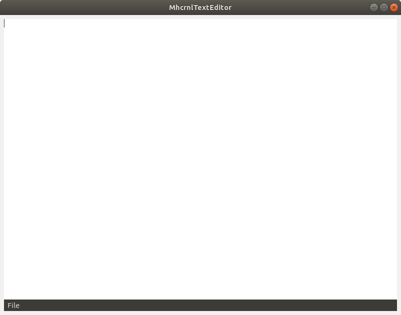

# MhcrnlTextEditor
#### #GTK3 #GTK2 #c #editor #text #text editor #Code::Blocks
## Install and run:

	git clone https://github.com/mhcrnl/MhcrnlTextEditor.git
	cd MhcrnlTextEditor
	./run.sh

## To send the code to Github:
	
	./gitpush.sh

## Photo:

## Tehnologies
Fedora 32 => GTK+3.24.23 => Code::Blocs 17.12

Ubuntu 18.04 => Code::Blocks 16.01 => gtk+2